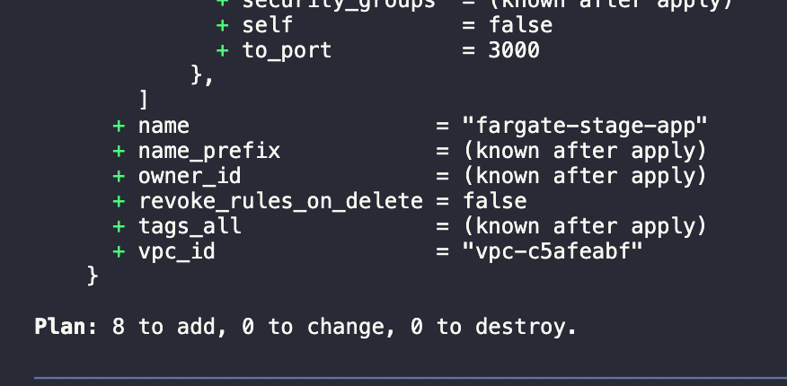
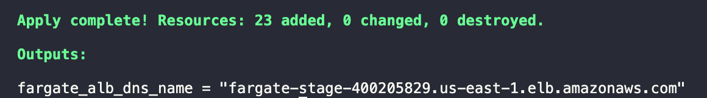

# DevOps Challenge

DevOps project to build an infrastructure using terraform and Setup in AWS ECS Fargate.

- [DevOps Challenge](#devops-challenge)
  - [Introduction](#introduction)
    - [Principal resources used](#principal-resources-used)
    - [Pre-requisites](#pre-requisites)
  - [Usage](#usage)
    - [Instructions to run the Application](#instructions-to-run-the-application)
    - [Instructions to run Infrastructure Project](#instructions-to-run-infrastructure-project)
    - [How to access the Application](#how-to-access-the-application)
    - [Clean up Infrastructure](#clean-up-infrastructure)
  - [Requirements to Production](#requirements-to-production)
  - [Potential Improvements](#potential-improvements)
    - [For the Python application](#for-the-python-application)
    - [For the ECS Fargate Service using Terraform](#for-the-ecs-fargate-service-using-terraform)
  - [Considerations](#considerations)
  - [Author](#author)
  - [License](#license)
## Introduction

This section describes the dependencies used in the application and the infrastructure, instructions on how to start the project, setup, and configuration of the environment for deployment.

### Principal resources used

* [Python](https://www.python.org/) - Programming language used, in version 3.9.9
* [Docker](https://www.docker.com) - Container creation tool to ease the application packaging process.
* [Terraform](https://www.terraform.io/) - A tool to create, modifying and versioning infrastructure with securely and efficiently.
* [AWS ECS Fargate](https://aws.amazon.com/fargate/) - Technology that can be used with Amazon ECS to run containers. 
*  [GitLab](http://gitlab.com) - Repository of the code versioning.

### Pre-requisites

What was needed to run the project:

- Python version 3.9.9
- Git installed
- Gitlab account
- Docker
- Terraform v1.0.11
- AWS account

- Please note that you will need the *access key* and *secret key* to your AWS account to run this project. 
  
## Usage
### Instructions to run the Application

Steps to run the application:

- Clone in project:
```
git clone git@gitlab.com:bbeckerdarosa/devops-challenge.git
```

- Access the project directory and run the application using docker:
```
cd devops-challenge/

docker build -t <user_docker_hub>/fargate-application-version .

docker run --rm -it -p 5000:5000 <user_docker_hub>/fargate-application-version
```

### Instructions to run Infrastructure Project

Steps to run the infrastructure with terraform:

- Clone in project:
```
git clone git@gitlab.com:bbeckerdarosa/devops-challenge.git
```

- Access the project directory and access the stage/ and cluster-fargate/ folder :
```
cd devops-challenge/stage/cluster-fargate/
```

- The file main.tf will be appear to you. To run and initialize terraform:

```
terraform init
```

- The follow next command will be:

```
terraform plan
```

In this moment, in your terminal, will appear to enter the values of *access key* and *secret key* (previously noted) from your AWS account.

If everything is right, the output of the ```terraform plan``` command will look something like this:



- And you can proceed with the next command to apply the creations to the aws:

```
terraform apply
```

As with the plan command, you will have to enter the values again of *access key* and *secret key* (previously noted) from your AWS account.

### How to access the Application

- In the terminal, at the end of running the terraform apply command, an output will be shown. This output is the load balancer DNS that you will need to access the application. An output like this should be shown:
  


- To access the application, go to your preferred browser and enter:

```http://<output_fargate_alb_dns_name>/version```

### Clean up Infrastructure

- To clean up/destroy the entire infrastructure you have created, you only need to type the command below:

```
terraform destroy
```

- At this point you will have to re-enter the *access key* and *secret key* values (previously noted) and just wait for the destroy to complete

## Requirements to Production

In order to scale-up in production the application in the ECS Fargate service, we could create a folder prod/cluster-fargate on the root of the project within this folder prod/cluster-fargate we’d get a main.tf file.
 
We could simply copy the main.tf from the folder stage/cluster-fargate e paste within the new production structure. 
 
Having the main.tf file contained in the prod/cluster-fargate structure, we would have to replace the variables within this file according to what we expect putting in production.
 
## Potential Improvements
### For the Python application
 
- The application was created to print text on the web. No logic was used for the version change according to the application execution. The first improvement that would have to be done is creating the logic to use application versioning showing the updated version as a variable. 
 
- We would have to create a Python script that’d have a variable called VERSION and this variable would be increased so for each execution the value would be changed. Then, We could do the import of this variable inside the application. 
 
### For the ECS Fargate Service using Terraform
 
- With the application working, we would create a route53 resource to the application so it would be redirected via DNS and not accessed by application load balancer dns.
 
- Last but not least, tests would be done showing zero downtime by doing whatever updates in the application. 
 
## Considerations
 
- Terraform module created to be reusable in the future environment.
- Value of the variables access and secret keys are requested by running the terraform plan/apply.

## Author

* **Bárbara Becker da Rosa** -  [GitHub](https://github.com/bbeckerdarosa)

<a href="https://github.com/bbeckerdarosa">
  
</a>

## License

This project fas MIT License - See the [LICENSE.md](LICENSE.md) file for more details.